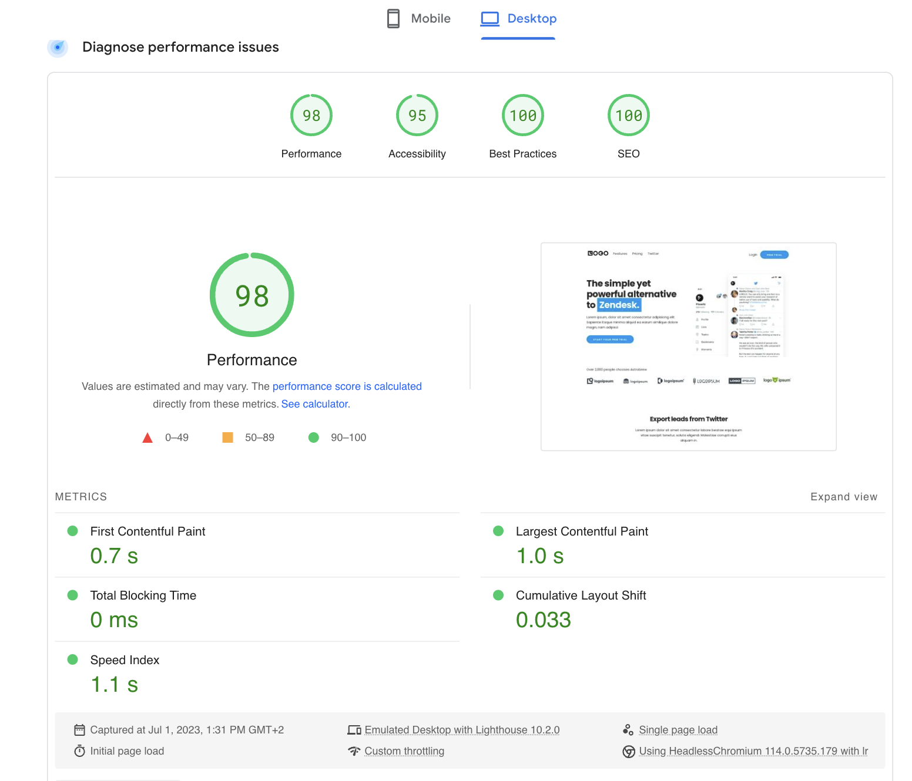

## Preview


## About
Astrobrew is a free and open-source elegant landing page for Micro SaaS products built with Astro & Skeleton CSS

### Live demo
(https://brew.indiebold.com/)

### Upgrade to Astrobrew Pro version
(https://brewpro.indiebold.com/)


## 🚀 Project Structure

Inside of your Astro project, you'll see the following folders and files:

```
/
├── public/
│   └── favicon.svg
├── src/
│   ├── components/
│   │   └── Features.astro
        └── FinalCta.astro
        └── Footer.astro
        └── Header.astro
        └── Hero.astro
        └── HowToUse.astro
│   ├── layouts/
│   │   └── Layout.astro
│   └── pages/
│       └── index.astro
└── package.json
```

## Score



## 🧞 Commands

All commands are run from the root of the project, from a terminal:

| Command                   | Action                                           |
| :------------------------ | :----------------------------------------------- |
| `npm install`             | Installs dependencies                            |
| `npm run dev`             | Starts local dev server at `localhost:3000`      |
| `npm run build`           | Build your production site to `./dist/`          |
| `npm run preview`         | Preview your build locally, before deploying     |


## 👀 Curious to Explore More?

Check out [LAB-CH3](https://github.com/LaB-CH3) for a growing collection of current and future templates.

If you’ve found this helpful, consider fueling my creativity!  
[](https://www.buymeacoffee.com/d2OuR1c)